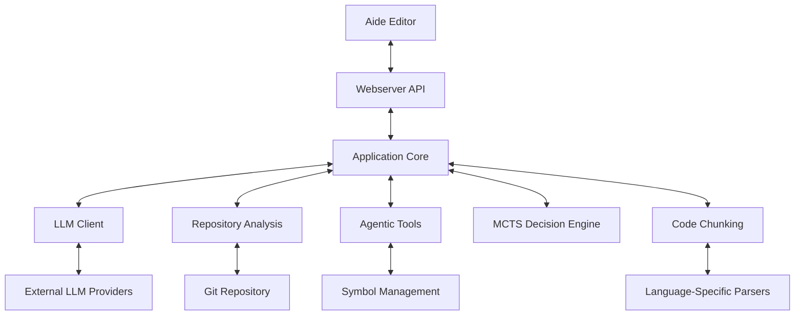
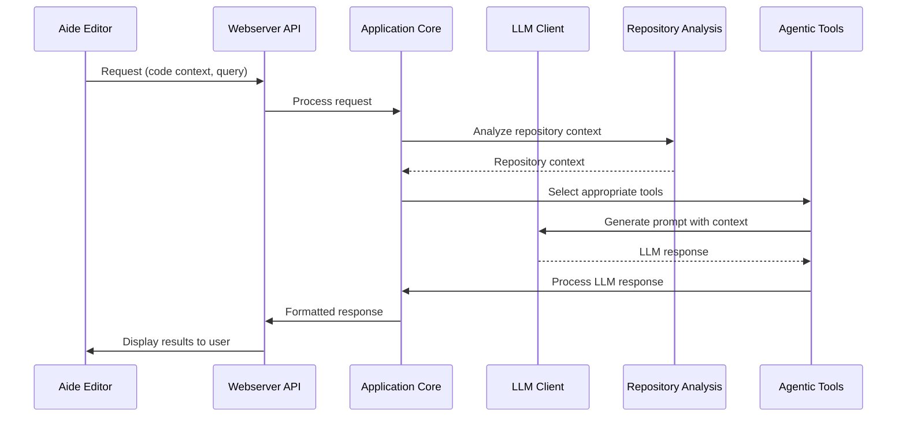
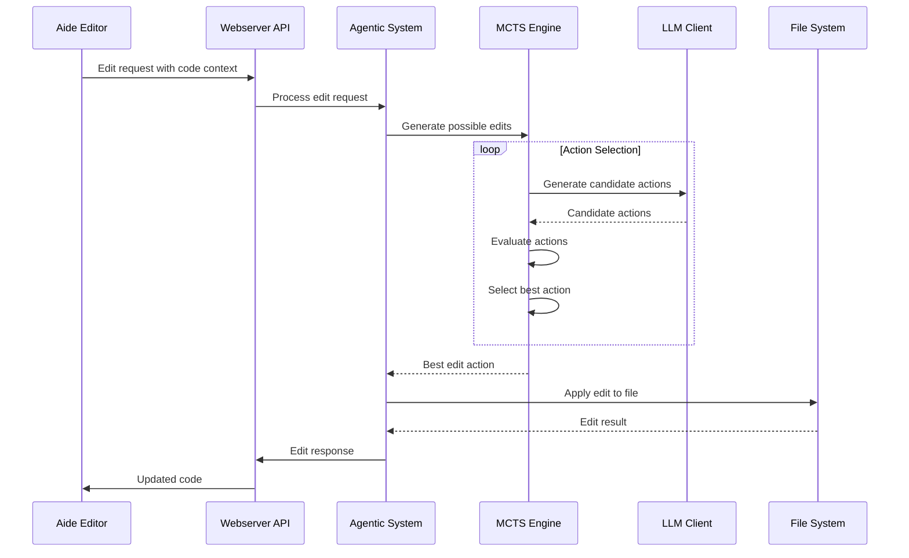
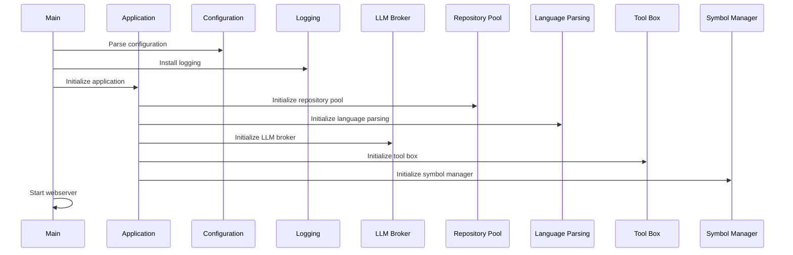
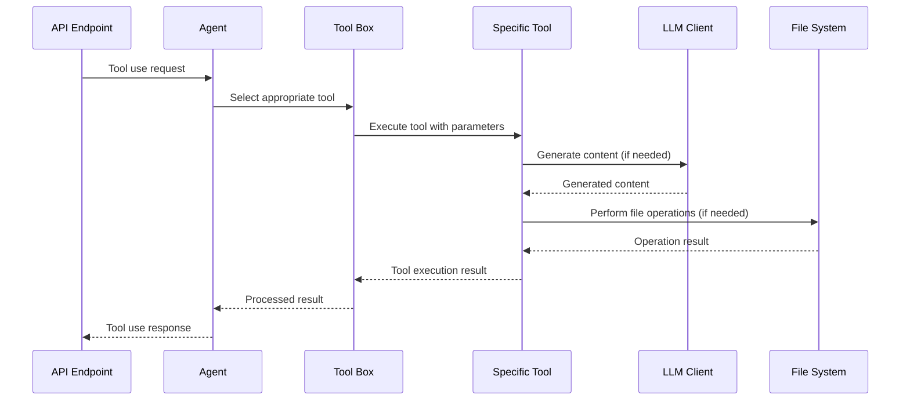

# Sidecar Architecture

This document provides a detailed explanation of the Sidecar architecture, including component interactions, data flow, and design decisions.

## Overview

Sidecar is built as a Rust workspace with multiple crates that work together to provide AI-powered code assistance. The architecture follows a modular design with clear separation of concerns.

## Core Components

### 1. Application Core

The Application Core is the central component that coordinates all other parts of the system. It initializes and manages the various subsystems, handles configuration, and provides a unified interface for the webserver.

**Key Responsibilities:**
- System initialization and configuration
- Component lifecycle management
- Resource allocation and management
- Cross-component coordination

**Implementation Details:**
- Located in `sidecar/src/application/`
- Main class: `Application` in `application.rs`
- Configuration handled by `Configuration` in `config/configuration.rs`

### 2. Webserver API

The Webserver API provides HTTP endpoints for the Aide editor to communicate with Sidecar. It handles request routing, authentication, and response formatting.

**Key Endpoints:**
- `/api/agentic/*`: Endpoints for AI agent operations
- `/api/tree_sitter/*`: Endpoints for code parsing and analysis
- `/api/file/*`: Endpoints for file operations
- `/api/plan/*`: Endpoints for planning operations

**Implementation Details:**
- Located in `sidecar/src/webserver/`
- Main entry point: `webserver.rs` in `sidecar/src/bin/`
- Uses Axum for HTTP routing and handling

### 3. LLM Client

The LLM Client handles communication with various Large Language Model providers. It manages API keys, formats requests according to provider specifications, and processes responses.

**Supported Providers:**
- OpenAI (GPT models)
- Anthropic (Claude models)
- Google AI (Gemini models)
- Various open-source models via Ollama, LM Studio, etc.

**Implementation Details:**
- Located in `llm_client/src/`
- Main broker: `LLMBroker` in `broker.rs`
- Provider-specific clients in `clients/`

### 4. Repository Analysis

The Repository Analysis component analyzes code repositories to build a graph representation of the codebase. It uses PageRank-like algorithms to identify important symbols and relationships.

**Key Features:**
- File and directory scanning
- Symbol extraction and relationship mapping
- Importance scoring using PageRank
- Context retrieval for relevant code sections

**Implementation Details:**
- Located in `sidecar/src/repomap/`
- Main analyzer: `Analyser` in `analyser.rs`
- Graph implementation in `graph.rs`

### 5. Agentic Tools

The Agentic Tools component provides a collection of tools that AI agents can use to perform complex code operations. It includes tools for code editing, symbol analysis, and context gathering.

**Key Tools:**
- Code editing tools
- Symbol analysis tools
- Repository search tools
- Context gathering tools

**Implementation Details:**
- Located in `sidecar/src/agentic/`
- Tool management in `tool/`
- Symbol management in `symbol/`
- Memory management in `memory/`

### 6. MCTS Decision Engine

The Monte Carlo Tree Search (MCTS) Decision Engine explores possible code changes and selects the most promising ones. It uses a tree-based search algorithm to evaluate different actions and their potential outcomes.

**Key Components:**
- Action node representation
- Selection strategies
- Value functions for evaluating changes
- Execution planning

**Implementation Details:**
- Located in `sidecar/src/mcts/`
- Action node implementation in `action_node.rs`
- Selection strategies in `selector/`
- Execution handling in `execution/`

### 7. Code Chunking

The Code Chunking component parses and chunks code into meaningful segments for better understanding by LLMs. It uses language-specific parsers to extract symbols, relationships, and context.

**Supported Languages:**
- Rust
- Python
- JavaScript/TypeScript
- Go

**Implementation Details:**
- Located in `sidecar/src/chunking/`
- Language-specific parsers in language-named files (e.g., `rust.rs`)
- Common parsing utilities in `helpers.rs`
- Text document management in `text_document.rs`

## Data Flow

### Request Processing Flow

### Code Editing Flow

## Component Interactions

### Application Initialization

### Tool Execution

## Design Decisions

### Modular Architecture

Sidecar uses a modular architecture with clear separation of concerns. This allows for easier maintenance, testing, and extension of the codebase.

**Benefits:**
- Components can be developed and tested independently
- New features can be added without affecting existing functionality
- Different teams can work on different components simultaneously

### Rust Workspace

The project is organized as a Rust workspace with multiple crates. This provides better dependency management and compilation times.

**Benefits:**
- Clear separation between major components
- Independent versioning of components
- Faster incremental compilation
- Better dependency management

### Asynchronous Processing

Sidecar uses asynchronous processing extensively to handle concurrent requests and long-running operations.

**Benefits:**
- Better resource utilization
- Improved responsiveness
- Ability to handle multiple requests simultaneously
- Support for streaming responses

### LLM Provider Abstraction

The LLM client uses an abstraction layer to support multiple LLM providers. This allows for easy switching between providers and support for new providers.

**Benefits:**
- Support for multiple LLM providers
- Easy addition of new providers
- Ability to switch providers at runtime
- Consistent interface for all providers

### Tree-sitter Integration

Sidecar uses Tree-sitter for code parsing and analysis. This provides accurate and efficient parsing for multiple programming languages.

**Benefits:**
- Support for multiple programming languages
- Accurate parsing and symbol extraction
- Efficient incremental parsing
- Rich query capabilities

## Performance Considerations

### Token Usage Optimization

Sidecar optimizes token usage to reduce costs and improve performance when communicating with LLM providers.

**Strategies:**
- Context pruning to remove irrelevant information
- Chunking large files into smaller segments
- Caching frequently used prompts and responses
- Using embeddings for efficient similarity search

### Caching

Sidecar uses caching at multiple levels to improve performance and reduce redundant operations.

**Cache Types:**
- Repository analysis cache
- LLM response cache
- Parsed code cache
- Symbol information cache

### Parallel Processing

Sidecar uses parallel processing for computationally intensive operations like repository analysis and code parsing.

**Parallel Operations:**
- File scanning and parsing
- Repository graph construction
- PageRank calculation
- MCTS exploration

## Security Considerations

### API Key Management

Sidecar handles API keys for various LLM providers. These keys are sensitive and must be protected.

**Security Measures:**
- Keys are never logged or exposed in responses
- Keys can be provided via environment variables
- Support for key rotation and management

### Code Execution

Sidecar does not execute user code directly, but it does perform file operations that could potentially be exploited.

**Security Measures:**
- Strict validation of file paths
- Limiting operations to the repository directory
- Careful handling of user input

### Authentication

The webserver API can be configured to require authentication for sensitive operations.

**Security Measures:**
- Support for token-based authentication
- Role-based access control
- Secure token validation

## Extensibility

### Plugin System

Sidecar is designed to be extensible through a plugin system. This allows for adding new functionality without modifying the core codebase.

**Extension Points:**
- New language support
- Additional tools
- Custom LLM providers
- Alternative repository analysis methods

### Configuration Options

Sidecar provides extensive configuration options to customize its behavior for different environments and use cases.

**Configurable Aspects:**
- LLM provider selection and parameters
- Repository analysis settings
- Caching behavior
- Performance tuning

## Conclusion

The Sidecar architecture is designed to be modular, extensible, and performant. It provides a solid foundation for AI-powered code assistance and can be extended to support new features and use cases.