# Sidecar Knowledge Graph

This document provides a comprehensive knowledge graph of the Sidecar codebase, showing the relationships between different components and modules.

## Repository Structure

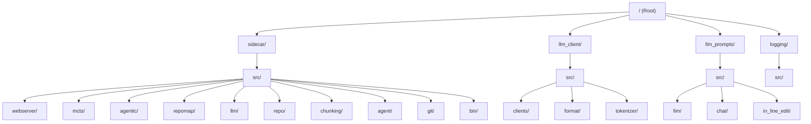

## Crate Dependencies

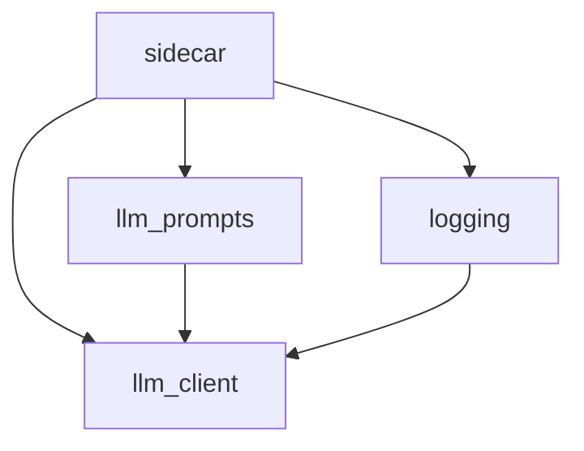

## Core Components and Their Relationships

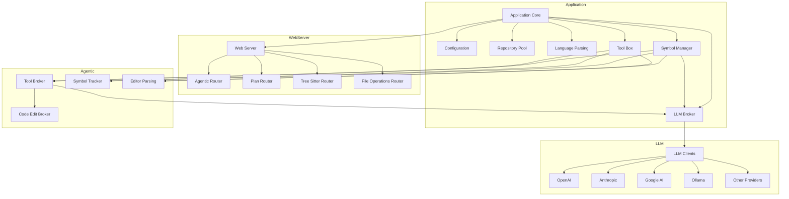

## Detailed Module Relationships

### Webserver Module

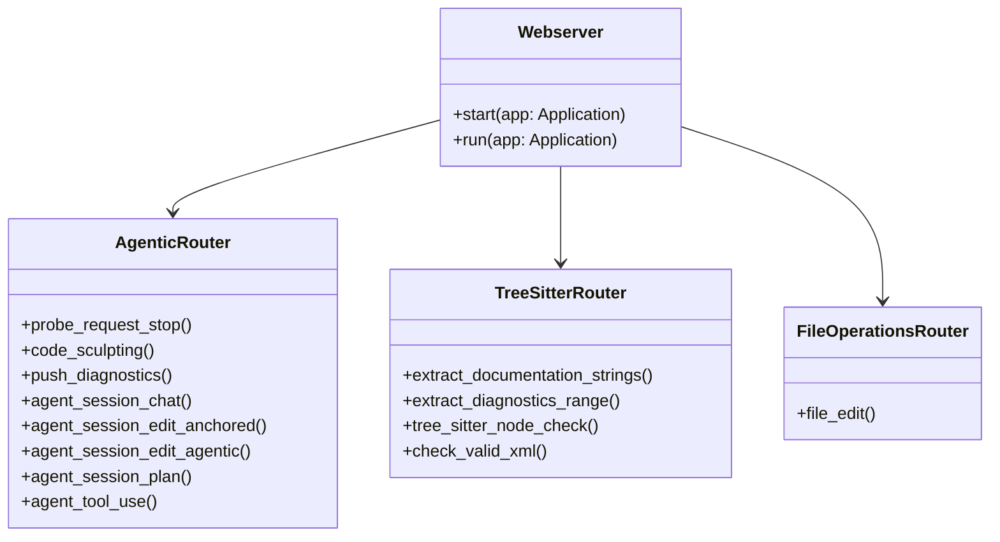

### Agentic Module

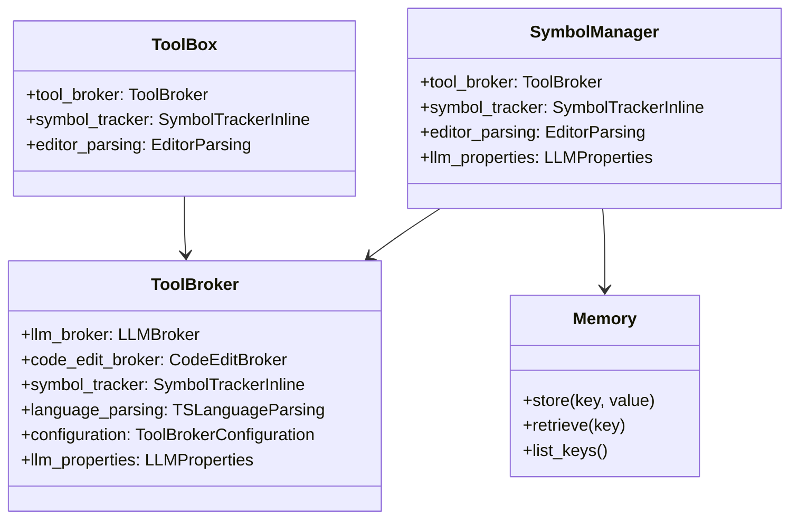

### MCTS (Monte Carlo Tree Search) Module

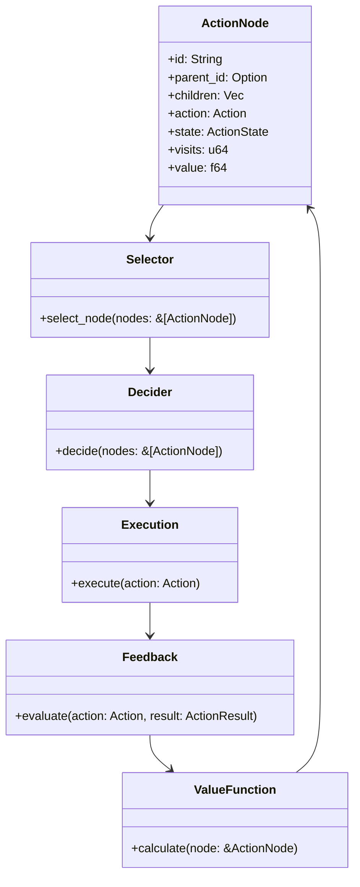

### Repository Mapping Module

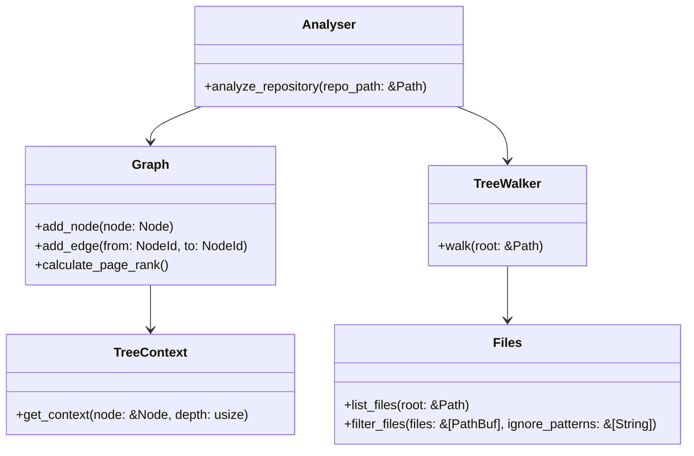

### LLM Client Module

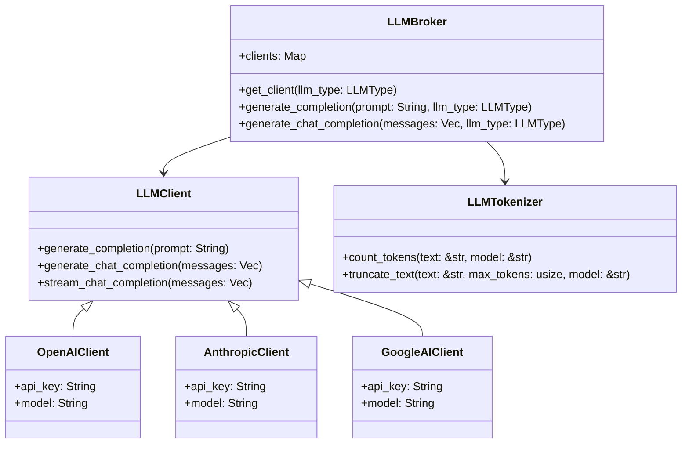

### Code Chunking Module

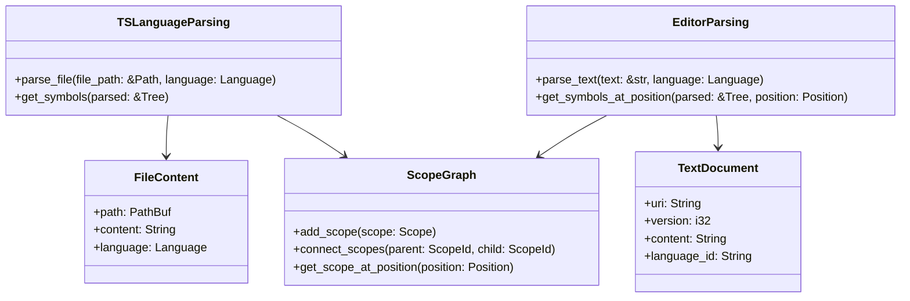

## Data Flow Diagrams

### Request Processing Flow

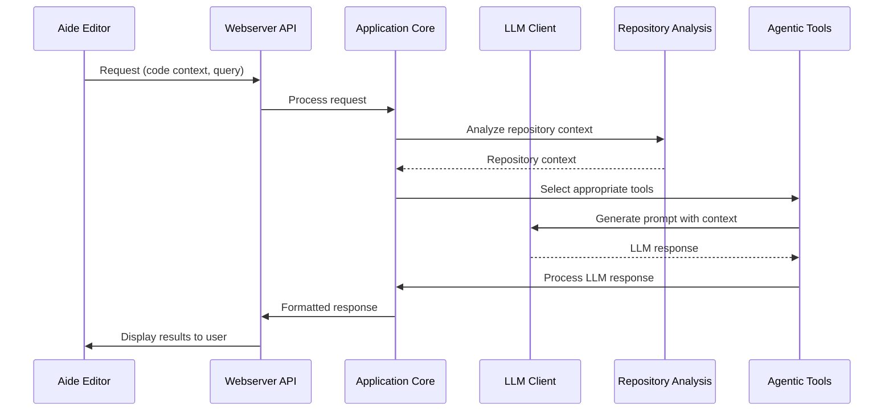

### Code Editing Flow

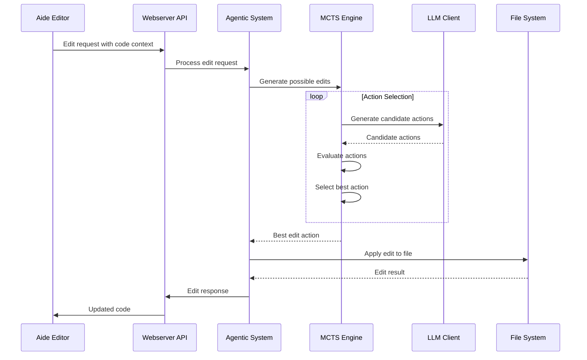

### Symbol Analysis Flow

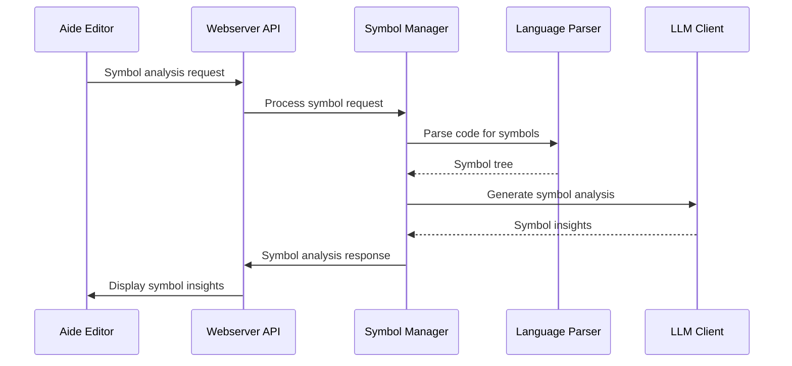

## Key Concepts and Abstractions

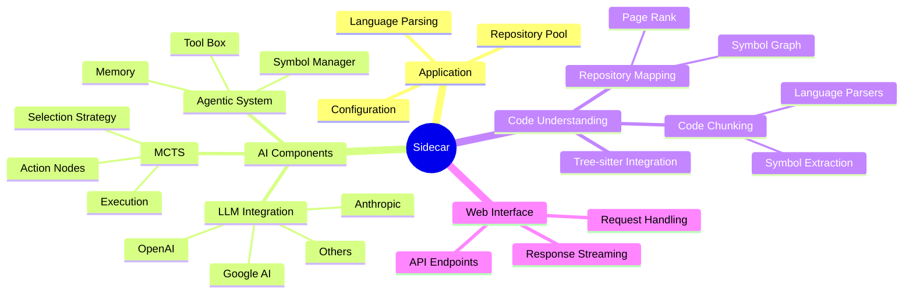

## Feature Dependency Graph

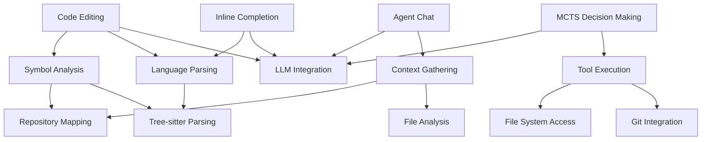

## Conclusion

This knowledge graph provides a comprehensive view of the Sidecar codebase structure and relationships between different components. It should help developers understand how the various parts of the system interact and how data flows through the application.