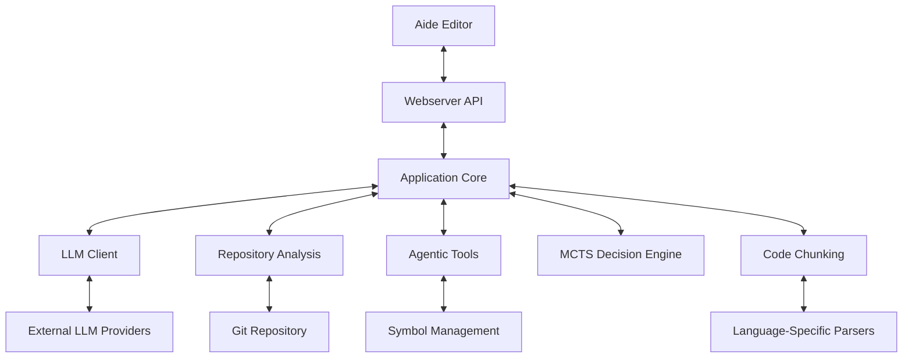
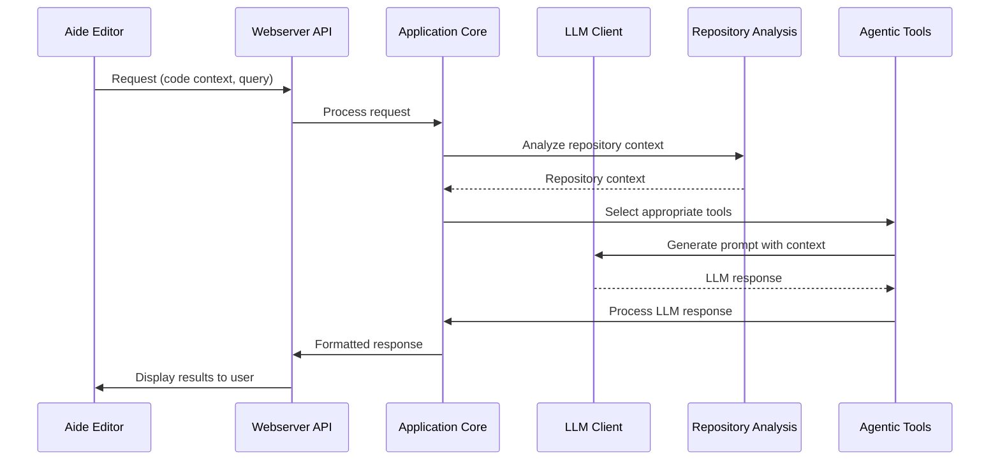
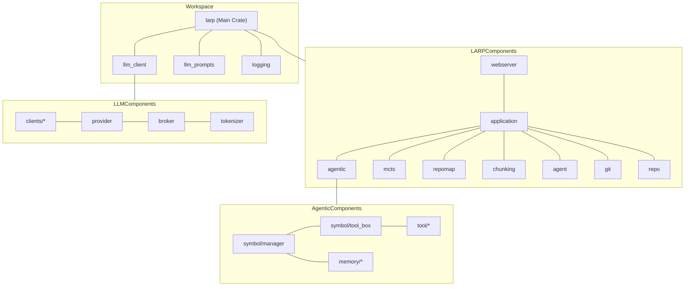
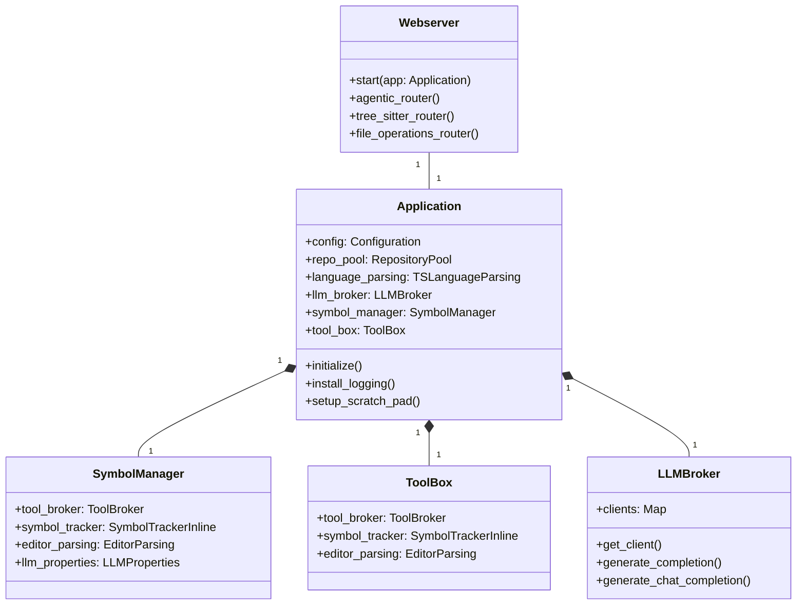
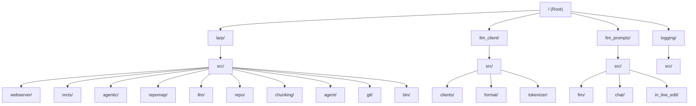

```
▓▓▓▓▓▓▓▓▓▓▓▓▓▓▒▓▓▓▓▒▒▓▒▒▒▒▒▒▒▒▒▒▒▒▒▒▒▒▒▒▒▓
▓▓▓▓▓▒▓▒▓▒▒▓▓▓▓█████▓▓▓▓▓▓▓▓▒▒▒▒▒▒▒▒▒▒▒▒▒▓
▓▓▓▒▒▒▒▒▒▓▓███████████▓▓██▓▓▓▓▓▓▓▒▒▒▒▒▒▒▒▒
▓▒▒▓▒▒▒▓██████▓▓▓▓▓▓▓▓▓▓▓▓▓▓▓▓▓▓▓▓▓▓▒▒▒▒▒▒
▓▒▒▒▒▒▓██▓▓▓▓▓▓▓▓▓▓▓▓▓▓▓▓▒▓▓▓▓▓▓▓▓▓▓▓▒▒▒▒▒
▓▒▒▒▒▓▓▓▓▓▓▓▓▓▓▓▓▓▓▓▓▓▓▓▓▓▒▓▓▓▓▓▓▓▓▓▓▓▒▒▒▒
▓▒▒▒▓▓▓▓▒▓▓▓▓▓▓▓▓▓▓▓▓▓▓▓▓▒▒▓▓▓▓▓▓▓▓▓▓▓▒▒▒▒
▓▒▒▒▓▓▓▒▓▓▓▓▓▓▓▓▓▓▓███▓▓▓▒▒▓▓▓███▓▓▓▓▓▒▒▒▒
▓▒▒▒▓▓▒▒▓▓▓▓▓▓▓▓▓█▒▒░░░░░░░░░░░░░▒█▒▓▓▒▒▒▒
▓▒▒▒▓▓▒▒▓██▓▓▓▓█▒░░░░░░░░░░░░░▓██▓░░░▒▒▒▒▒
▓▒▒▓▓▓▒▓▓▓▓▓░░░░░▓▓█▓░░░░░░░░▒█░██▓░░░▒░▒▒
▓▒▒▓▓▒▓▓▓▒▒░░░░░██▓███▓░░░░░░█████░░░░░░░▒
▓▒▒▓▓░░░░░░░░░░▓▒█████▓░░░░░░▒███▒░░░░░░░▒
██▓▓▓▒░░░░░░░░░░░▓███▓▒░░░░░░░░░▒░░░▒▒▒▒▒▒
███▓▓▓▓▒░░░░░░░░░░▒█▒░░░░░░░░░░░░░▒▓▒▓▓▓▒▒
████▓▓▓▓██▓▒░░░░░░░░░░░░░░░▒░░░░░▒▓▒▓▓▓▓▓▓
███████▓▓██████▓▒░░░░░░░░░░░░░░▒▓▓████████
████████▓▓▓████████▓▒░░░░░░▒▓▓▓▓▓▓████████
███████████▓▓██████▓▓▓▓▓▓▓▓███████████████
███████████████▓▓▓▓▓▓▓▓▓▓▓▓▓▓▓▓▓▓█████████
██████████████▓▓▓▓▓▓▓▓▓▓▓▓▓▓▓▓▓▓▓▓████████
█████████████▓▓▓▓▓▓▓▓▓▓▓▓▓▓▓▓▓▓▓▓▓████████
█████████████▓▓▓▓▓▓▓▓▓▓▓▓▓▓▓▓▓▓▓▓▓▓███████
    
                                                                       
                                                        
```

<div id="vscodium-logo" align="center">
    
    <h1>LARP</h1>
</div>


# LARP: The AI Brain for Aide Editor

## Overview

LARP is the AI intelligence engine that powers the Aide code editor. It handles everything from prompt creation and LLM communication to code analysis and intelligent editing assistance. This repository contains the core AI functionality that enables Aide to understand and interact with your codebase at a deep level.

## Table of Contents

- [Architecture](#architecture)
- [Core Components](#core-components)
- [Knowledge Graph](#knowledge-graph)
- [Getting Started](#getting-started)
- [Project Structure](#project-structure)
- [Key Features](#key-features)
- [Integration with Aide](#integration-with-aide)
- [Feature Ideas](#feature-ideas)
- [Contributing](#contributing)
- [Feedback](#feedback)
- [Code of Conduct](#code-of-conduct)
- [License](#license)

## Architecture

LARP is built as a Rust workspace with multiple crates that work together to provide AI-powered code assistance. The architecture follows a modular design with clear separation of concerns.



### Data Flow



## Core Components

LARP consists of several key components that work together:

### 1. Webserver

The entry point for the application, handling HTTP requests from the Aide editor. It provides API endpoints for various AI-assisted operations.

**Key Files:**
- `larp/src/bin/webserver.rs`: Main entry point
- `larp/src/webserver/mod.rs`: API route definitions

### 2. LLM Client

Handles communication with various Large Language Model providers (OpenAI, Anthropic, etc.).

**Key Features:**
- Support for multiple LLM providers
- Token counting and management
- Request formatting for different models
- Response parsing and streaming

### 3. Agentic System

The core AI agent system that can perform complex code operations.

**Key Components:**
- Tool selection and execution
- Memory management for context retention
- Symbol-level intelligence for code understanding
- Session management for ongoing interactions

### 4. Monte Carlo Tree Search (MCTS)

A decision-making system that explores possible code changes and selects the most promising ones.

**Key Features:**
- Action node representation
- Selection strategies
- Value functions for evaluating changes
- Execution planning

### 5. Repository Mapping

Analyzes and maps the structure of a code repository to provide context for AI operations.

**Key Features:**
- PageRank-based importance scoring
- Symbol relationship graphing
- File and directory analysis
- Context retrieval for relevant code sections

### 6. Code Chunking

Parses and chunks code into meaningful segments for better understanding by LLMs.

**Key Features:**
- Language-specific parsing (Rust, Python, JavaScript, TypeScript, Go)
- Symbol extraction and relationship mapping
- Scope analysis
- Text document management

## Knowledge Graph



### Component Relationships



## Getting Started

### Prerequisites

- Rust 1.79 or later
- Cargo with workspace support
- Git (for repository analysis features)

### Installation

1. Clone the repository:
   ```bash
   git clone https://github.com/codestoryai/larp.git
   cd larp
   ```

2. Build the project:
   ```bash
   cargo build --bin webserver
   ```

3. Run the webserver:
   ```bash
   ./target/debug/webserver
   ```

### Configuration

LARP can be configured through command-line arguments or environment variables. Key configuration options include:

- LLM provider API keys
- Port and host settings
- Repository indexing options
- Logging levels and destinations

## Project Structure



## Key Features

### Symbol-Level Intelligence

LARP can understand and operate on individual code symbols (functions, classes, variables) with context awareness.

### Repository Mapping

Builds a graph representation of your codebase to understand relationships between files and symbols.

### Multi-Language Support

Supports parsing and understanding of multiple programming languages:
- Rust
- Python
- JavaScript/TypeScript
- Go

### Agentic Tools

Provides a collection of tools that AI agents can use to perform complex code operations:
- Code editing
- Symbol analysis
- Repository search
- Context gathering

### Monte Carlo Tree Search

Uses MCTS to explore possible code changes and select the most promising ones for implementation.

## Integration with Aide

LARP is designed to work seamlessly with the Aide editor. To connect your local LARP instance with Aide:

1. Run the Aide production build or build from source using [this repository](https://github.com/codestoryai/ide)
2. Run the larp binary
3. Since you have a larp binary already running, the editor will prefer to use this over starting its own process
4. Congratulations! You are now running larp for Aide locally with your own built binary

## Feature Ideas

Here are 10 creative and easy-to-implement ideas for enhancing LARP:

1. **Language-Specific Documentation Generator**: Automatically generate documentation comments based on code analysis and best practices for each language.

2. **Code Health Metrics Dashboard**: Create a simple dashboard that shows code quality metrics and suggests improvements.

3. **Commit Message Generator**: Analyze git diffs and generate meaningful commit messages based on the changes.

4. **Test Case Generator**: Automatically generate unit tests for functions based on their signatures and usage patterns.

5. **Code Explanation Mode**: Add a feature to explain complex code sections in plain English with customizable detail levels.

6. **Dependency Analyzer**: Scan the codebase for outdated or vulnerable dependencies and suggest updates.

7. **Code Style Enforcer**: Implement a tool that suggests style improvements based on language-specific best practices.

8. **Performance Hotspot Detector**: Analyze code to identify potential performance bottlenecks and suggest optimizations.

9. **Interactive Tutorial Generator**: Create interactive tutorials for new developers to understand the codebase structure.

10. **Code Review Assistant**: Implement a tool that provides automated code review comments based on common issues and best practices.

## Contributing

There are many ways in which you can participate in this project, for example:

- [Submit bugs and feature requests](https://github.com/codestoryai/larp/issues), and help us verify as they are checked in
- Review [source code changes](https://github.com/codestoryai/larp/pulls)

If you are interested in fixing issues and contributing directly to the code base,
please see the document [How to Contribute](HOW_TO_CONTRIBUTE.md), which covers the following:

- [How to build and run from source](HOW_TO_CONTRIBUTE.md)
- [The development workflow, including debugging and running tests](HOW_TO_CONTRIBUTE.md#debugging)
- [Submitting pull requests](HOW_TO_CONTRIBUTE.md#pull-requests)

## Feedback

- [File an issue](https://github.com/codestoryai/larp/issues)
- [Request a new feature](CONTRIBUTING.md)
- Upvote [popular feature requests](https://github.com/codestoryai/larp/issues?q=is%3Aopen+is%3Aissue+label%3Afeature-request+sort%3Areactions-%2B1-desc)
- Join our community: [Discord](https://discord.gg/mtgrhXM5Xf)

## Code of Conduct

This project has adopted the [Contributor Covenant Code of Conduct](CODE_OF_CONDUCT.md). Please read the Code of Conduct before contributing to this project.

## License

Copyright (c) 2024 CodeStory AI. All rights reserved.
Licensed under the [GNU Affero General Public License v3.0](LICENSE.md).
