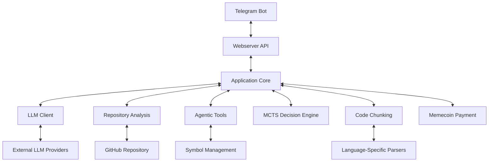
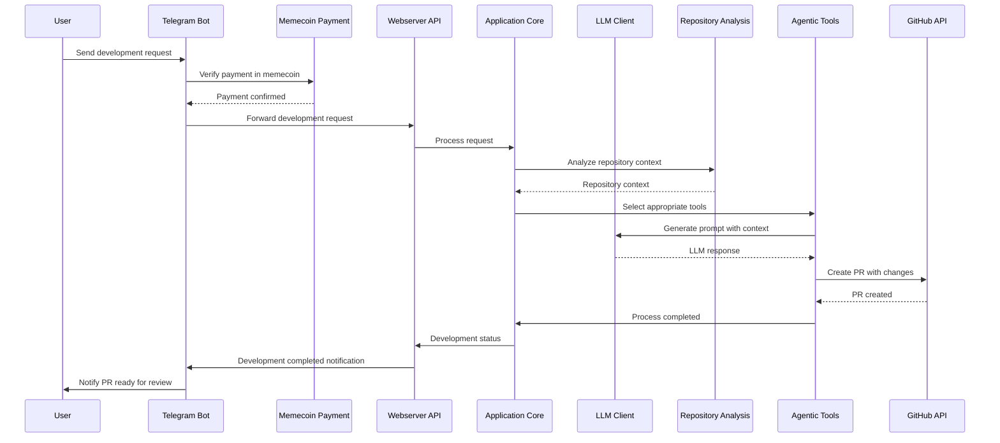
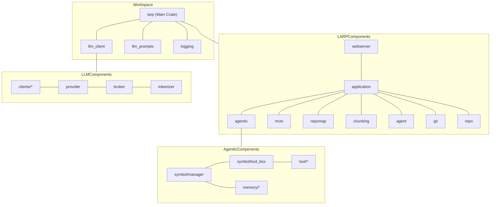
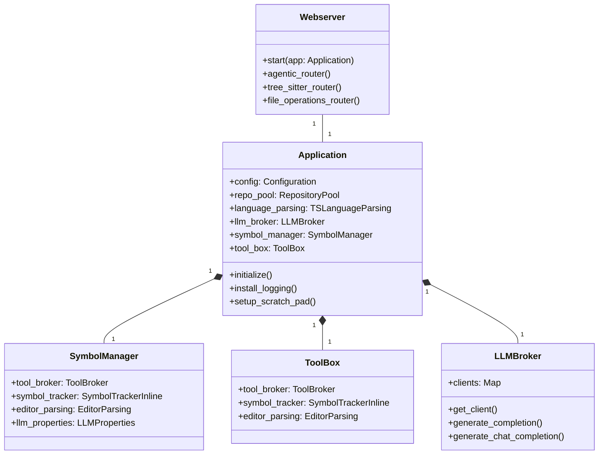
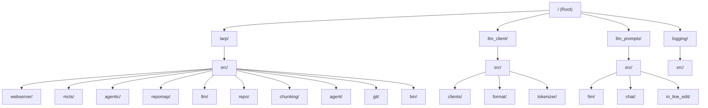

```
▓▓▓▓▓▓▓▓▓▓▓▓▓▓▒▓▓▓▓▒▒▓▒▒▒▒▒▒▒▒▒▒▒▒▒▒▒▒▒▒▒▓
▓▓▓▓▓▒▓▒▓▒▒▓▓▓▓█████▓▓▓▓▓▓▓▓▒▒▒▒▒▒▒▒▒▒▒▒▒▓
▓▓▓▒▒▒▒▒▒▓▓███████████▓▓██▓▓▓▓▓▓▓▒▒▒▒▒▒▒▒▒
▓▒▒▓▒▒▒▓██████▓▓▓▓▓▓▓▓▓▓▓▓▓▓▓▓▓▓▓▓▓▓▒▒▒▒▒▒
▓▒▒▒▒▒▓██▓▓▓▓▓▓▓▓▓▓▓▓▓▓▓▓▒▓▓▓▓▓▓▓▓▓▓▓▒▒▒▒▒
▓▒▒▒▒▓▓▓▓▓▓▓▓▓▓▓▓▓▓▓▓▓▓▓▓▓▒▓▓▓▓▓▓▓▓▓▓▓▒▒▒▒
▓▒▒▒▓▓▓▓▒▓▓▓▓▓▓▓▓▓▓▓▓▓▓▓▓▒▒▓▓▓▓▓▓▓▓▓▓▓▒▒▒▒
▓▒▒▒▓▓▓▒▓▓▓▓▓▓▓▓▓▓▓███▓▓▓▒▒▓▓▓███▓▓▓▓▓▒▒▒▒
▓▒▒▒▓▓▒▒▓▓▓▓▓▓▓▓▓█▒▒░░░░░░░░░░░░░▒█▒▓▓▒▒▒▒
▓▒▒▒▓▓▒▒▓██▓▓▓▓█▒░░░░░░░░░░░░░▓██▓░░░▒▒▒▒▒
▓▒▒▓▓▓▒▓▓▓▓▓░░░░░▓▓█▓░░░░░░░░▒█░██▓░░░▒░▒▒
▓▒▒▓▓▒▓▓▓▒▒░░░░░██▓███▓░░░░░░█████░░░░░░░▒
▓▒▒▓▓░░░░░░░░░░▓▒█████▓░░░░░░▒███▒░░░░░░░▒
██▓▓▓▒░░░░░░░░░░░▓███▓▒░░░░░░░░░▒░░░▒▒▒▒▒▒
███▓▓▓▓▒░░░░░░░░░░▒█▒░░░░░░░░░░░░░▒▓▒▓▓▓▒▒
████▓▓▓▓██▓▒░░░░░░░░░░░░░░░▒░░░░░▒▓▒▓▓▓▓▓▓
███████▓▓██████▓▒░░░░░░░░░░░░░░▒▓▓████████
████████▓▓▓████████▓▒░░░░░░▒▓▓▓▓▓▓████████
███████████▓▓██████▓▓▓▓▓▓▓▓███████████████
███████████████▓▓▓▓▓▓▓▓▓▓▓▓▓▓▓▓▓▓█████████
██████████████▓▓▓▓▓▓▓▓▓▓▓▓▓▓▓▓▓▓▓▓████████
█████████████▓▓▓▓▓▓▓▓▓▓▓▓▓▓▓▓▓▓▓▓▓████████
█████████████▓▓▓▓▓▓▓▓▓▓▓▓▓▓▓▓▓▓▓▓▓▓███████
    
                                                                       
                                                        
```

<div align="center">
    <h1>larp.dev</h1>
    <p><strong>AI-powered autonomous code development, paid in memecoins</strong></p>
</div>

<p align="center">
  <a href="https://github.com/opensvm/larp/releases/latest"></a>
  <a href="https://telegram.me/larpdev_bot"></a>
  <a href="https://github.com/opensvm/larp/stargazers"></a>
  <a href="LICENSE.md"></a>
</p>

# larp: Autonomous GitHub Agentic Developer

## Overview

larp is a revolutionary autonomous AI agent that transforms how software development happens on GitHub. By combining state-of-the-art AI with blockchain technology, larp enables fully automated code development without human intervention:

- **Add the bot** to your GitHub organization or repository
- **Send development tasks** through our Telegram bot
- **Pay with memecoins** at rates based on task complexity
- **Receive completed PRs** ready for review and merge

No more waiting for developer availability or paying excessive hourly rates. larp works 24/7, understands your codebase at a deep level, and delivers high-quality code changes at a fraction of traditional development costs.

This repository contains the core AI functionality powering larp's ability to understand code context, generate appropriate solutions, and interact with GitHub repositories autonomously.

## Table of Contents

- [Architecture](#architecture)
- [Core Components](#core-components)
- [Knowledge Graph](#knowledge-graph)
- [Getting Started](#getting-started)
- [Project Structure](#project-structure)
- [Key Features](#key-features)
- [Integration with GitHub & Telegram](#integration-with-github--telegram)
- [Feature Ideas](#feature-ideas)
- [Contributing](#contributing)
- [Feedback](#feedback)
- [Code of Conduct](#code-of-conduct)
- [License](#license)

## Architecture

larp is built as a Rust workspace with multiple crates that work together to provide autonomous GitHub development capabilities. The architecture follows a modular design with clear separation of concerns.



### Data Flow



## Core Components

larp consists of several key components that work together:

### 1. Webserver & Telegram Bot Integration

The entry point for the application, handling requests from the Telegram bot and processing memecoin payments. It provides API endpoints for autonomous GitHub operations.

**Key Files:**
- `larp/src/bin/webserver.rs`: Main entry point
- `larp/src/webserver/mod.rs`: API route definitions

### 2. LLM Client

Handles communication with various Large Language Model providers (OpenAI, Anthropic, etc.).

**Key Features:**
- Support for multiple LLM providers
- Token counting and management
- Request formatting for different models
- Response parsing and streaming

### 3. Agentic System

The core AI agent system that can perform complex code operations.

**Key Components:**
- Tool selection and execution
- Memory management for context retention
- Symbol-level intelligence for code understanding
- Session management for ongoing interactions

### 4. Monte Carlo Tree Search (MCTS)

A decision-making system that explores possible code changes and selects the most promising ones.

**Key Features:**
- Action node representation
- Selection strategies
- Value functions for evaluating changes
- Execution planning

### 5. Repository Mapping

Analyzes and maps the structure of a code repository to provide context for AI operations.

**Key Features:**
- PageRank-based importance scoring
- Symbol relationship graphing
- File and directory analysis
- Context retrieval for relevant code sections

### 6. Code Chunking

Parses and chunks code into meaningful segments for better understanding by LLMs.

**Key Features:**
- Language-specific parsing (Rust, Python, JavaScript, TypeScript, Go)
- Symbol extraction and relationship mapping
- Scope analysis
- Text document management

## Knowledge Graph



### Component Relationships



## Getting Started

### Prerequisites

- Rust 1.79 or later
- Cargo with workspace support
- Git (for repository analysis features)

### Installation

1. Clone the repository:
   ```bash
   git clone https://github.com/opensvm/larp.git
   cd larp
   ```

2. Build the project:
   ```bash
   cargo build --bin webserver
   ```

3. Run the webserver:
   ```bash
   ./target/debug/webserver
   ```

### Configuration

larp can be configured through command-line arguments or environment variables. Key configuration options include:

- LLM provider API keys
- Port and host settings
- Repository indexing options
- Logging levels and destinations

## Project Structure



## Key Features

### Symbol-Level Intelligence

larp can understand and operate on individual code symbols (functions, classes, variables) with context awareness.

### Repository Mapping

Builds a graph representation of your codebase to understand relationships between files and symbols.

### Multi-Language Support

Supports parsing and understanding of multiple programming languages:
- Rust
- Python
- JavaScript/TypeScript
- Go

### Agentic Tools

Provides a collection of tools that AI agents can use to perform complex code operations:
- Code editing
- Symbol analysis
- Repository search
- Context gathering

### Monte Carlo Tree Search

Uses MCTS to explore possible code changes and select the most promising ones for implementation.

## Integration with GitHub & Telegram

larp seamlessly connects your GitHub repositories with a convenient Telegram interface, all powered by secure memecoin payments.

### Setup Process

1. **GitHub Integration:** Add the `@larp-bot` to your GitHub organization or repository
   ```
   /settings/installations
   ```

2. **Telegram Connection:** Start a conversation with our Telegram bot
   ```
   https://t.me/larpdev_bot
   ```

3. **Link Your Accounts:** Use the `/connect` command in Telegram and authenticate with GitHub
   ```
   /connect
   ```

4. **Configure Memecoin Wallet:** Set up your preferred memecoin wallet 
   ```
   /wallet set <your-wallet-address>
   ```

### Using larp

Once connected, development is as simple as:

1. **Send Requirements:** Describe your task in plain English
   ```
   /dev Add a dark mode toggle to the navbar component
   ```

2. **Review Cost Estimate:** Confirm the quoted price in memecoins
   ```
   Task: Add dark mode toggle
   Estimated complexity: Medium
   Price: 420 DOGE
   Type /confirm to proceed
   ```

3. **Track Progress:** Monitor development status
   ```
   /status
   ```

4. **Review & Merge:** Examine the completed PR directly in GitHub

## Feature Ideas

Here are 10 creative and easy-to-implement ideas for enhancing larp:

1. **Language-Specific Documentation Generator**: Automatically generate documentation comments based on code analysis and best practices for each language.

2. **Code Health Metrics Dashboard**: Create a simple dashboard that shows code quality metrics and suggests improvements.

3. **Commit Message Generator**: Analyze git diffs and generate meaningful commit messages based on the changes.

4. **Test Case Generator**: Automatically generate unit tests for functions based on their signatures and usage patterns.

5. **Code Explanation Mode**: Add a feature to explain complex code sections in plain English with customizable detail levels.

6. **Dependency Analyzer**: Scan the codebase for outdated or vulnerable dependencies and suggest updates.

7. **Code Style Enforcer**: Implement a tool that suggests style improvements based on language-specific best practices.

8. **Performance Hotspot Detector**: Analyze code to identify potential performance bottlenecks and suggest optimizations.

9. **Interactive Tutorial Generator**: Create interactive tutorials for new developers to understand the codebase structure.

10. **Code Review Assistant**: Implement a tool that provides automated code review comments based on common issues and best practices.

## Contributing

There are many ways in which you can participate in this project, for example:

- [Submit bugs and feature requests](https://github.com/opensvm/larp/issues), and help us verify as they are checked in
- Review [source code changes](https://github.com/opensvm/larp/pulls)

If you are interested in fixing issues and contributing directly to the code base,
please see the document [How to Contribute](HOW_TO_CONTRIBUTE.md), which covers the following:

- [How to build and run from source](HOW_TO_CONTRIBUTE.md)
- [The development workflow, including debugging and running tests](HOW_TO_CONTRIBUTE.md#debugging)
- [Submitting pull requests](HOW_TO_CONTRIBUTE.md#pull-requests)

## Feedback

- [File an issue](https://github.com/opensvm/larp/issues)
- [Request a new feature](CONTRIBUTING.md)
- Upvote [popular feature requests](https://github.com/opensvm/larp/issues?q=is%3Aopen+is%3Aissue+label%3Afeature-request+sort%3Areactions-%2B1-desc)
- Join our community: [Discord](https://discord.gg/mtgrhXM5Xf)

## Code of Conduct

This project has adopted the [Contributor Covenant Code of Conduct](CODE_OF_CONDUCT.md). Please read the Code of Conduct before contributing to this project.

## License

Copyright (c) 42069 larp devs

fork if u want to fork, nobody cares about IP in 2025
