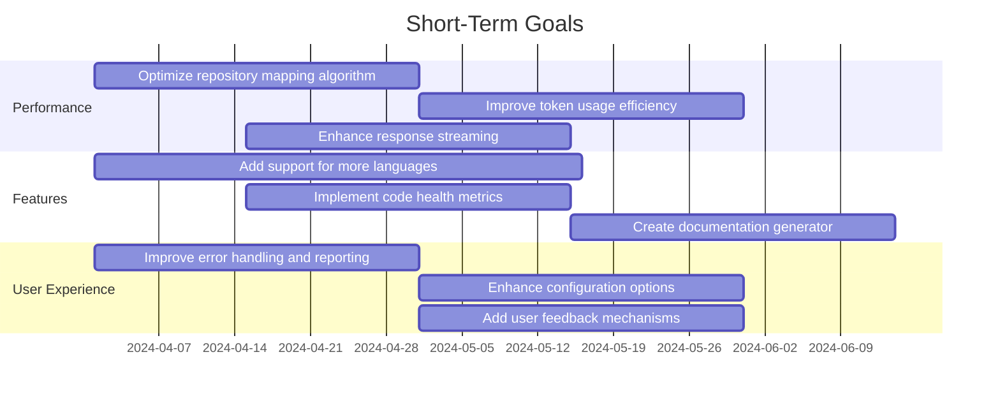
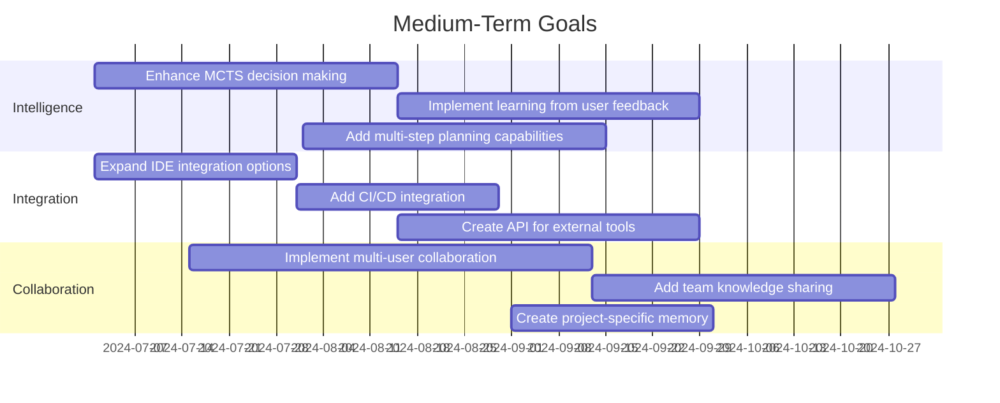
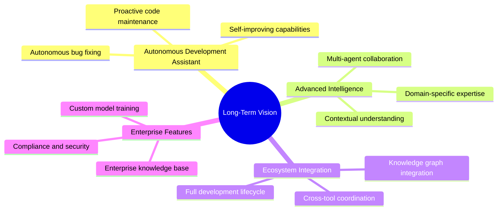
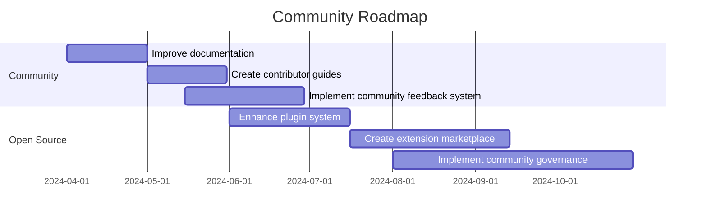

# Sidecar Project Roadmap

This document outlines the future direction and planned enhancements for the Sidecar project.

## Current Status

Sidecar is currently a functional AI-powered code assistant that integrates with the Aide editor. It provides capabilities for:

- Code understanding and analysis
- AI-assisted code editing
- Repository mapping and context gathering
- Multi-language support (Rust, Python, JavaScript/TypeScript, Go)
- Integration with multiple LLM providers

## Short-Term Goals (0-3 months)

### Performance Improvements

1. **Optimize Repository Mapping Algorithm**
   - Improve the efficiency of the PageRank algorithm for large codebases
   - Implement incremental updates to avoid full re-indexing
   - Add caching mechanisms for frequently accessed symbols

2. **Improve Token Usage Efficiency**
   - Enhance context pruning to reduce token usage
   - Implement smarter chunking strategies for large files
   - Optimize prompt templates for different LLM providers

3. **Enhance Response Streaming**
   - Reduce latency in streaming responses
   - Implement partial result processing
   - Add progress indicators for long-running operations

### Feature Enhancements

1. **Add Support for More Languages**
   - Add support for Java, C#, and PHP
   - Improve existing language parsers
   - Create a plugin system for language-specific features

2. **Implement Code Health Metrics**
   - Add code complexity analysis
   - Implement duplicate code detection
   - Create visualizations for code health metrics

3. **Create Documentation Generator**
   - Automatically generate documentation from code
   - Support multiple documentation formats (Markdown, JSDoc, etc.)
   - Integrate with existing documentation tools

### User Experience Improvements

1. **Improve Error Handling and Reporting**
   - Enhance error messages with actionable information
   - Implement error recovery mechanisms
   - Add detailed logging for troubleshooting

2. **Enhance Configuration Options**
   - Create a unified configuration system
   - Add support for project-specific configurations
   - Implement configuration validation

3. **Add User Feedback Mechanisms**
   - Implement thumbs up/down feedback for AI responses
   - Create a system for collecting and analyzing user feedback
   - Use feedback to improve AI responses over time

## Medium-Term Goals (3-6 months)

### Intelligence Enhancements

1. **Enhance MCTS Decision Making**
   - Improve action selection algorithms
   - Implement more sophisticated value functions
   - Add support for parallel exploration

2. **Implement Learning from User Feedback**
   - Create a system for learning from user edits
   - Implement preference learning from feedback
   - Add personalization based on user behavior

3. **Add Multi-Step Planning Capabilities**
   - Implement hierarchical planning
   - Add support for complex refactoring operations
   - Create visualization tools for plans

### Integration Improvements

1. **Expand IDE Integration Options**
   - Add support for more code editors (VS Code, JetBrains IDEs)
   - Implement deeper integration with editor features
   - Create a standardized protocol for editor communication

2. **Add CI/CD Integration**
   - Implement integration with popular CI/CD systems
   - Add support for automated code reviews
   - Create tools for test generation and validation

3. **Create API for External Tools**
   - Design and implement a public API
   - Create documentation and examples
   - Build a plugin system for extending functionality

### Collaboration Features

1. **Implement Multi-User Collaboration**
   - Add support for real-time collaboration
   - Implement conflict resolution mechanisms
   - Create tools for sharing context between users

2. **Add Team Knowledge Sharing**
   - Implement team-specific knowledge bases
   - Create tools for sharing insights between team members
   - Add support for organizational knowledge

3. **Create Project-Specific Memory**
   - Implement long-term memory for projects
   - Add support for project-specific preferences
   - Create tools for knowledge transfer between projects

## Long-Term Vision (6+ months)

### Autonomous Development Assistant

- **Self-Improving Capabilities**: Implement systems that learn from interactions and improve over time
- **Proactive Code Maintenance**: Develop features that proactively suggest improvements and fixes
- **Autonomous Bug Fixing**: Create capabilities for automatically identifying and fixing common bugs

### Advanced Intelligence

- **Multi-Agent Collaboration**: Implement systems where multiple specialized agents work together
- **Domain-Specific Expertise**: Develop expertise in specific domains (web development, data science, etc.)
- **Contextual Understanding**: Enhance understanding of project context, business logic, and requirements

### Ecosystem Integration

- **Full Development Lifecycle**: Integrate with all aspects of the development lifecycle
- **Cross-Tool Coordination**: Enable coordination between different development tools
- **Knowledge Graph Integration**: Create a comprehensive knowledge graph of code, documentation, and discussions

### Enterprise Features

- **Compliance and Security**: Add features for ensuring code compliance and security
- **Custom Model Training**: Provide tools for training custom models on proprietary codebases
- **Enterprise Knowledge Base**: Create an enterprise-wide knowledge base for code and best practices

## Community Roadmap

### Community Building

1. **Improve Documentation**
   - Enhance user and developer documentation
   - Create tutorials and examples
   - Add interactive documentation

2. **Create Contributor Guides**
   - Develop comprehensive guides for contributors
   - Create templates for common contributions
   - Implement mentoring programs for new contributors

3. **Implement Community Feedback System**
   - Create tools for gathering community feedback
   - Implement transparent feature voting
   - Develop a roadmap influenced by community needs

### Open Source Development

1. **Enhance Plugin System**
   - Create a robust plugin architecture
   - Develop tools for plugin development
   - Implement plugin testing and validation

2. **Create Extension Marketplace**
   - Build a marketplace for community extensions
   - Implement rating and review systems
   - Create tools for discovering useful extensions

3. **Implement Community Governance**
   - Develop transparent governance processes
   - Create systems for community decision-making
   - Implement open planning and prioritization

## Conclusion

This roadmap outlines the planned direction for the Sidecar project, but it is subject to change based on user feedback, technological advancements, and community contributions. We welcome input from the community to help shape the future of Sidecar.