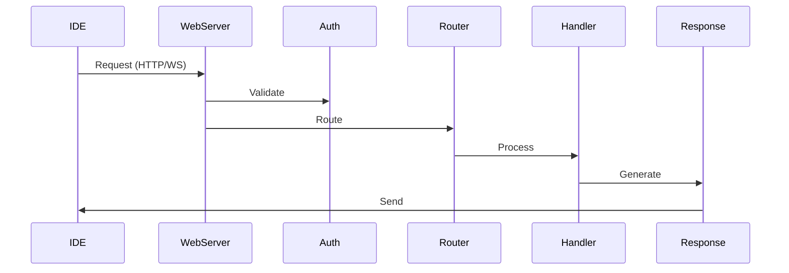
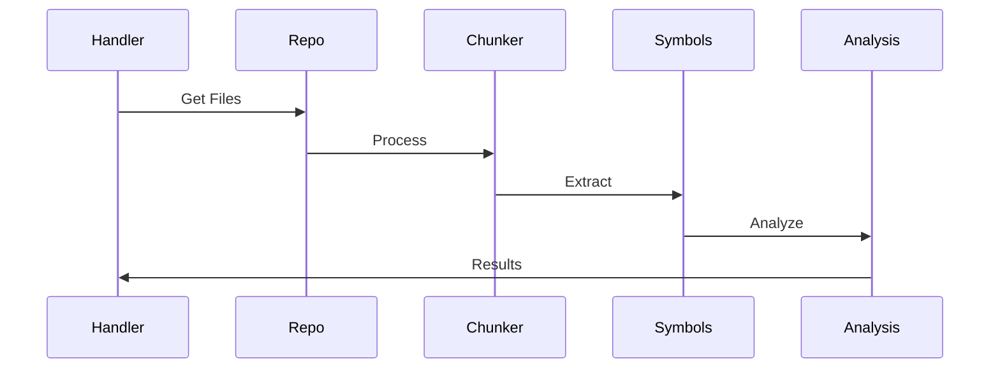

# Sidecar Architecture Guide

This document provides a detailed overview of Sidecar's architecture and how its components work together.

## High-Level Architecture

```
┌─────────────────┐     ┌──────────────┐     ┌───────────────┐
│  IDE Extension  │◄────┤   WebServer  │◄────┤  AI Pipeline  │
└─────────────────┘     └──────────────┘     └───────────────┘
                             │                       ▲
                             ▼                       │
                        ┌──────────────┐     ┌───────────────┐
                        │  Repository  │────►│ Code Analysis │
                        │   Manager    │     │    Engine     │
                        └──────────────┘     └───────────────┘
```

## Core Components

### 1. WebServer (`src/webserver/`)
- HTTP/WebSocket server using Axum
- Handles API requests and real-time communication
- Manages authentication and session state
- Routes requests to appropriate handlers

### 2. AI Pipeline (`src/agentic/`)
- Processes code analysis requests
- Manages LLM interactions
- Handles prompt generation and response parsing
- Implements retry and fallback logic

### 3. Repository Manager (`src/repo/`)
- Git integration and version control
- File system operations
- Cache management
- Change tracking

### 4. Code Analysis Engine
- Symbol extraction and mapping
- Dependency analysis
- Code chunking and parsing
- Language-specific processing

## Data Flow

1. **Request Processing:**


2. **Code Analysis:**


## Key Subsystems

### 1. Symbol Management (`src/symbol/`)
```rust
pub struct Symbol {
    name: String,
    kind: SymbolKind,
    location: Location,
    children: Vec<Symbol>,
}

impl Symbol {
    pub fn analyze(&self) -> Analysis {
        // Symbol-specific analysis
    }
}
```

### 2. LLM Integration (`src/llm/`)
```rust
pub trait LLMProvider {
    async fn complete(&self, prompt: &str) -> Result<String>;
    async fn embed(&self, text: &str) -> Result<Vec<f32>>;
}
```

### 3. Repository Mapping (`src/repomap/`)
```rust
pub struct RepoMap {
    nodes: Vec<Node>,
    edges: Vec<Edge>,
    page_rank: HashMap<NodeId, f64>,
}
```

## State Management

### 1. Application State
```rust
pub struct AppState {
    config: Config,
    llm_client: Arc<dyn LLMProvider>,
    repo_manager: Arc<RepoManager>,
}
```

### 2. Session State
```rust
pub struct Session {
    id: String,
    context: Context,
    history: Vec<Interaction>,
}
```

## Performance Optimizations

### 1. Caching System
- In-memory cache for frequent operations
- Disk cache for larger datasets
- Cache invalidation strategies

### 2. Parallel Processing
- Async request handling
- Parallel file processing
- Concurrent LLM requests

## Security Architecture

### 1. Authentication
- Token-based authentication
- Role-based access control
- Session management

### 2. Data Security
- API key encryption
- Secure WebSocket connections
- Input sanitization

## Error Handling

### 1. Error Types
```rust
#[derive(Error, Debug)]
pub enum SidecarError {
    #[error("IO error: {0}")]
    IO(#[from] std::io::Error),
    
    #[error("LLM error: {0}")]
    LLM(String),
    
    #[error("Analysis error: {0}")]
    Analysis(String),
}
```

### 2. Recovery Strategies
- Graceful degradation
- Automatic retries
- Fallback mechanisms

## Configuration System

### 1. Environment Configuration
```toml
[server]
host = "0.0.0.0"
port = 3001

[llm]
provider = "openai"
model = "gpt-4"

[analysis]
chunk_size = 1000
cache_ttl = 3600
```

### 2. Runtime Configuration
- Dynamic model switching
- Feature flags
- Performance tuning

## Extension Points

### 1. Language Support
- Language parser interface
- Custom analysis rules
- Language-specific optimizations

### 2. LLM Providers
- Provider interface
- Custom prompt templates
- Response processors

## Monitoring and Telemetry

### 1. Metrics
- Request latency
- Token usage
- Cache hit rates
- Error rates

### 2. Logging
- Structured logging
- Performance tracing
- Error tracking

## Development Guidelines

### 1. Code Organization
- Feature-based directory structure
- Clear separation of concerns
- Consistent naming conventions

### 2. Testing Strategy
- Unit tests per component
- Integration tests for workflows
- Performance benchmarks

## Future Architecture

### 1. Planned Improvements
- Distributed processing
- Enhanced caching
- Real-time collaboration

### 2. Scalability Plans
- Horizontal scaling
- Load balancing
- Database sharding